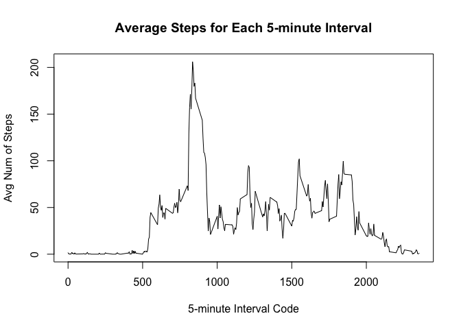

# Reproducible Research: Peer Assessment 1


## Loading and preprocessing the data

```r
Activity <- read.csv('activity.csv')
```


## What is mean total number of steps taken per day?

```r
TotalStepsPerDay <- aggregate(Activity$steps, list(Activity$date), sum)
hist(TotalStepsPerDay$x, 
     xlab = "Steps per day", 
     ylab = "Number of days", 
     main = "Histogram of total steps per day", 
     breaks = "Sturges")
```

 

```r
# mean total steps per day
mean(TotalStepsPerDay$x, na.rm = T)
```

```
## [1] 10766.19
```

```r
# median total steps per day
median(TotalStepsPerDay$x, na.rm = T)
```

```
## [1] 10765
```


## What is the average daily activity pattern?

```r
AvgStepsPerInterval <- aggregate(Activity$steps, 
                             list(Activity$interval), 
                             mean, 
                             na.rm = T, 
                             na.action = na.omit)
plot(AvgStepsPerInterval, 
     type = "l", 
     xlab = "5-minute interval code", 
     ylab = "Avg num of steps",
     main = "Average steps for each 5-minute interval")
```

 

```r
# Interval with most steps per day on average
AvgStepsPerInterval[AvgStepsPerInterval$x == max(AvgStepsPerInterval$x), 1]
```

```
## [1] 835
```


## Imputing missing values

```r
Activity.NA.bool <- is.na(Activity$steps)
Activity.NA <- Activity[Activity.NA.bool,]
# Number of intervals with no data
length(Activity.NA[,1])
```

```
## [1] 2304
```

```r
ImputedActivity <- Activity

# iterate through each row of dataset
for(i in 1:nrow(ImputedActivity)) 
{
    # check to see if row contains NA
    if (is.na(ImputedActivity[i, 1])) 
    {
        # find the corresponding interval
        interval = ImputedActivity[i, 3] 
        # find the average steps for this interval
        avgSteps = AvgStepsPerInterval[AvgStepsPerInterval$Group.1 == interval,2]
        # update the NA value with the average steps
        ImputedActivity[i,1] <- avgSteps
    }
}

ImputedTotalStepsPerDay <- aggregate(ImputedActivity$steps, list(ImputedActivity$date), sum)
hist(ImputedTotalStepsPerDay$x, 
     xlab = "Steps per day", 
     ylab = "Number of days", 
     main = "Histogram of total steps per day with NA values imputed", 
     breaks = "Sturges")
```

 

```r
# mean total steps per day
mean(ImputedTotalStepsPerDay$x, na.rm = T)
```

```
## [1] 10766.19
```

```r
# median total steps per day
median(ImputedTotalStepsPerDay$x, na.rm = T)
```

```
## [1] 10766.19
```

## Are there differences in activity patterns between weekdays and weekends?
